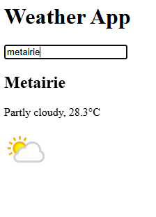
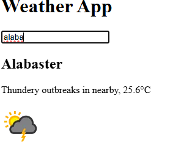

# React + Webpack Starter (Codex Template)

Welcome to your React exploration! 🎉 Over the past week we’ve dived deep into Webpack—now it’s time to build with React while still seeing Webpack under the hood. This template:

- **Automatically scaffolds** a working React + Webpack project via `npx`.
- **Keeps** the full Webpack config, Babel settings, and CSS pipeline in your repo.
- **Reduces** setup errors so you can focus on React concepts.

---

## 🚀 Getting Started

npx react-webpack-codex my-app
cd my-app
npm install (installs React, Webpack, Babel, loaders, etc.)
npm run dev (starts dev server at http://localhost:3000)

_(To build for production: `npm run build` → `dist/`.)_

---

## 🗂 Project Structure

```
my-app/
├─ public/
│  └─ index.html
├─ src/
│  ├─ app.css
│  ├─ index.jsx
│  ├─ App.jsx
│  └─ components/
│     ├─ Header.jsx
│     ├─ Main.jsx
│     ├─ Footer.jsx
│     └─ ui/
│        └─ Card.jsx
├─ .babelrc
├─ package.json
└─ webpack.config.mjs
```

---

## 🔧 Available Scripts

- **npm run dev**
  Starts the Webpack Dev Server with fast refresh on port 3000.

- **npm run build**
  Bundles your app for production into `./dist`.

- **npm run preview**
  Serves the production build locally at http://localhost:5000.

---

## ✏️ Customizing for Your Own Projects

1. **Remove starter components**
   `rm -rf src/components && mkdir src/components`

2. **Clear out the App return**
   In `src/App.jsx`, replace the existing JSX with your own:

   ```jsx
   export default function App() {
     return <div>{/* Your custom React code here */}</div>;
   }
   ```

3. **Add new components** under `src/components/`.

4. **Style as you go** – rename `app.css` → `app.scss` later if you want SCSS support.

---

## ℹ️ Why This Template?

- **Exposes Webpack config** so you understand loader/plugin setup.
- **Automates** repetitive setup via `npx`, reducing “it works on my machine” issues.
- **Defaults** to port 3000, matching most React tutorials.
- **SCSS-ready** out of the box—just rename `.css` → `.scss` when ready.

Happy coding!
Feel free to peek into any config files when you’re curious—everything you need is right here.



